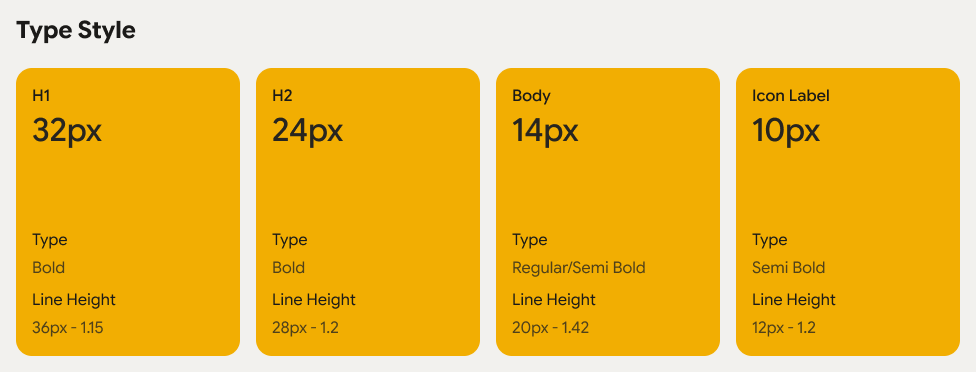
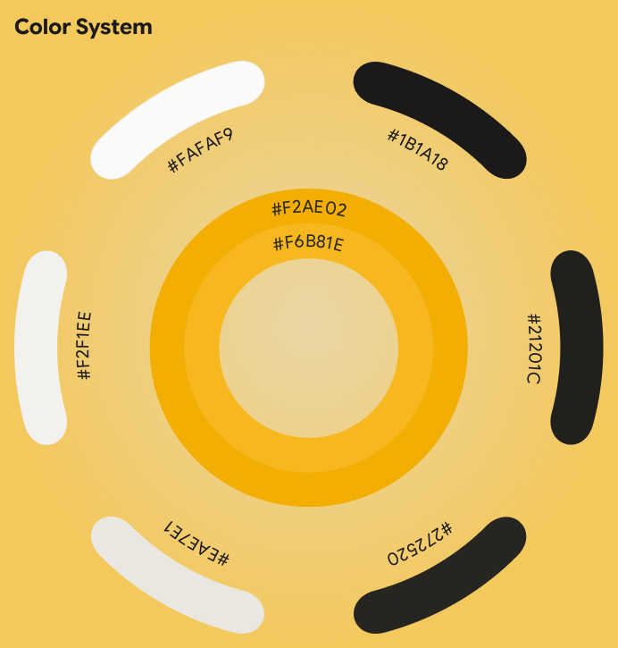
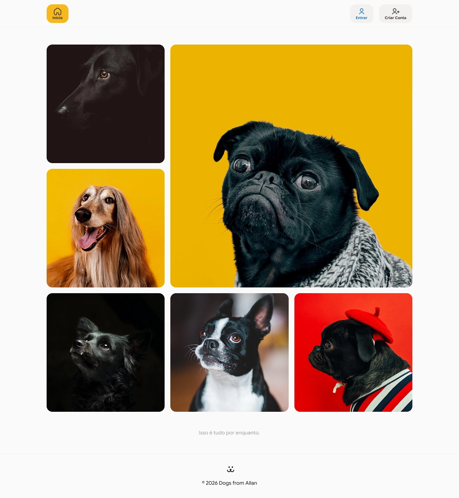
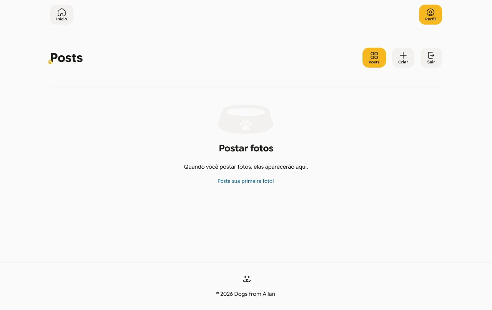
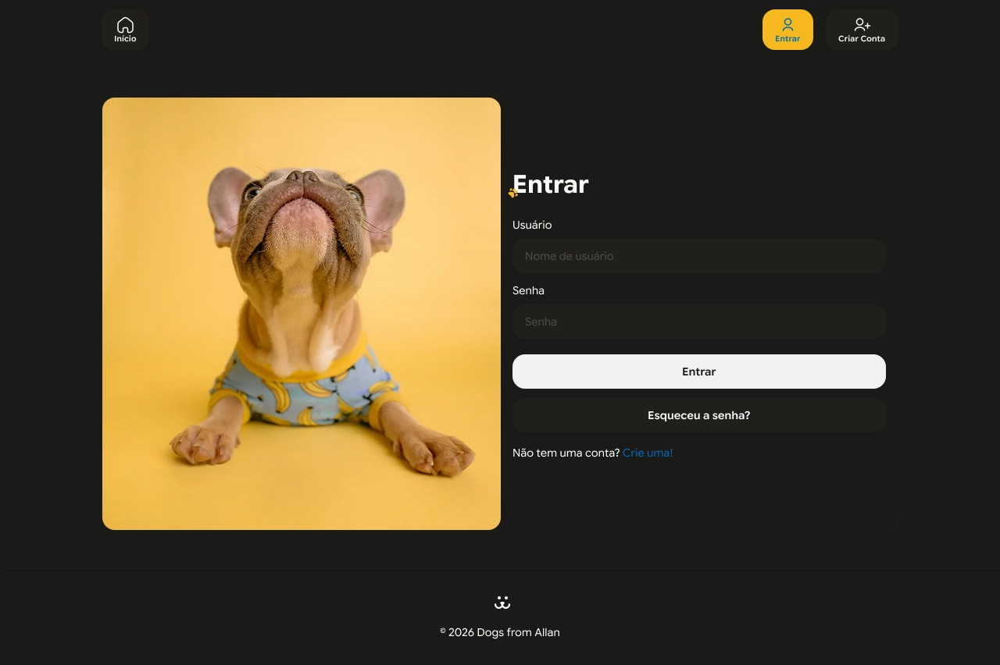
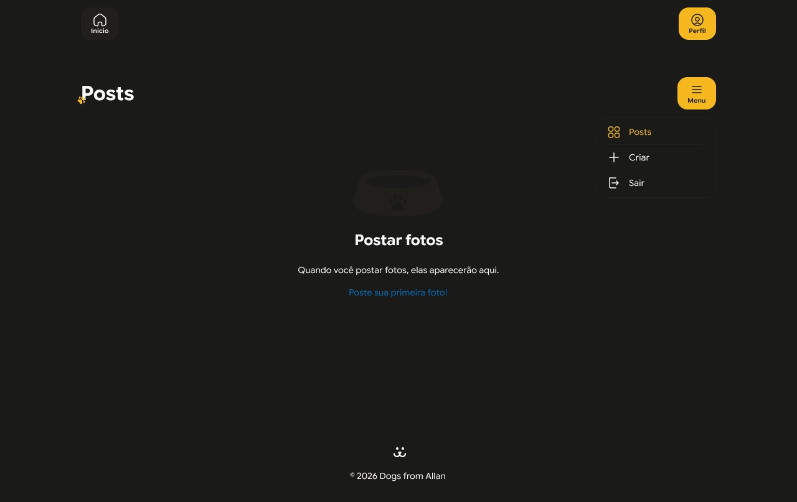

# Dogs

<div align="center">
  
  
  
  
  
  
</div>

<p align="center">
  <strong>Uma rede social para cachorros, desenvolvida com foco em UX, arquitetura moderna e prática profissional de React.</strong>
</p>

## 📌 Visão Geral

O **Dogs** é uma rede social focada em cachorros. O projeto original faz parte da trilha de React da **Origamid**, mas foi evoluído para uma versão mais robusta, visualmente mais refinada e melhor alinhada com as práticas modernas do front-end.

A ideia central foi ir além da reprodução fiel do projeto original: aplicar o que foi aprendido na prática, expandir a stack, reforçar a experiência do usuário e transformar o app em uma solução mais próxima do que se vê em produtos reais de mercado.

Este projeto combina:

- fundamentos sólidos de React e TypeScript;
- arquitetura moderna com roteamento tipado e cache inteligente;
- estudo aprofundado de UX/UI com interface pensada para diferentes contextos e temas;
- boas práticas de autenticação, validação, feedback visual e organização de código.

## 🚀 Diferencial do Projeto

O maior diferencial deste projeto não foi apenas “construir o app”, mas fazer isso com intenção e consistência técnica.

Ao longo do desenvolvimento, tive a preocupação de ampliar a stack do projeto original para incluir ferramentas mais modernas e de alta qualidade, além de criar uma interface com identidade própria, mais amigável e mais próxima de um produto pensado para usuários reais.

### Principais diferenciais

- evolução de stack para uma arquitetura mais profissional;
- uso de roteamento e carregamento de dados mais sofisticados;
- aplicação de validação robusta de formulários e respostas da API;
- feedback visual para ações do usuário com toasts e confirmações;
- experiência adaptada para light e dark mode;
- interface reformulada com foco em usabilidade, hierarquia visual e melhor experiência mobile.

A implementação dessa versão mostra proatividade para ir além do escopo do curso e entender que, em projetos reais, a decisão técnica e a experiência do usuário pesam tanto quanto o código em si.

## 🧩 O que o projeto faz

A aplicação funciona como uma rede social voltada para compartilhamento de fotos de pets, especialmente cachorros. O usuário consegue navegar, se autenticar, publicar conteúdo, interagir com outras fotos e explorar perfis.

### Funcionalidades principais

#### Autenticação e conta

- cadastro de usuário;
- login com validação de dados;
- logout com limpeza do estado local e sessão;
- proteção de rotas autenticadas;
- persistência de sessão no cliente;
- recuperação de senha;
- reset de senha com token/validação.

#### Feed e navegação

- listagem de fotos em feed;
- página individual para cada foto;
- página de perfil para cada usuário;
- navegação por rotas dinâmicas;
- scroll infinito para carregamento contínuo de conteúdo;
- modal para visualização ampliada da foto;
- menu hambúrguer para melhor experiência mobile;
- layout adaptado para tema claro e escuro.

#### Publicação e gerenciamento de conteúdo

- criação de nova postagem com imagem;
- envio de dados como nome, peso e idade do pet;
- validação de campos antes do envio;
- remoção de foto com confirmação;
- feedback visual ao deletar ou realizar ações importantes;
- atualização de listas e estados após interações.

#### Interação social

- comentários em fotos;
- exibição de detalhes da publicação;
- contador de visualizações;
- páginas com foco em compartilhamento.

#### UX e feedback visual

- toast para mensagens de sucesso e erro;
- confirmação antes de ação destrutiva;
- estados de loading, erro e vazio;
- melhor experiência de acessibilidade e navegação com componentes de UI mais robustos.

## 🛠️ Tecnologias utilizadas

A stack do projeto foi escolhida para representar uma evolução significativa em relação ao projeto original do curso e para exercitar tecnologias que agregam real valor ao desenvolvimento React.

### Core

- React 19
- TypeScript
- Vite
- JavaScript/TypeScript moderno

### Roteamento e estado

- TanStack Router
- TanStack Query
- Zustand

### Formulários e validação

- React Hook Form
- Zod
- @hookform/resolvers

### Requisições HTTP

- Axios

### UI/UX e componentes

- Tailwind CSS
- Radix UI
- React Hot Toast
- react-intersection-observer

### Outros

- clsx
- react-error-boundary
- localStorage persistido via middleware do Zustand

## ✨ Melhorias implementadas

Além de manter o escopo funcional do projeto original, esta versão focou em refinamentos que fazem diferença no produto final.

### 1. Roteamento mais moderno

- rotas baseadas em arquivos e tipagem forte;
- melhor organização da aplicação;
- carregamento e navegação mais previsíveis;
- suporte de scroll restoration e comportamento de navegação mais natural.

### 2. Gerenciamento de dados e cache

- React Query para consultas assíncronas e sincronização de dados;
- controle mais eficiente de estados que vêm da API;
- melhor experiência em operações repetidas e atualizações em tempo real.

### 3. Estado global leve e claro

- Zustand para autenticação e estado de sessão;
- persistência local sem tanta complexidade;
- solução menor e mais direta que alternativas mais pesadas.

### 4. Validação real de formulários

- React Hook Form integrado ao Zod;
- prevenções de erros antes do envio;
- melhor qualidade de dados e menos falhas em produção.

### 5. UX refinada e acessível

- Radix para componentes de interação mais acessíveis;
- toast para feedback rápido;
- modal com melhor controle de foco e navegação;
- menu mobile pensado para telas menores.

### 6. Design com identidade própria

- interface mais amigável e visualmente moderna;
- tema claro e escuro para respeitar a preferência do usuário;
- atenção a contraste, proporção, espaçamento e legibilidade;
- estética que se distancia do visual mais “didático” do projeto original e se aproxima mais de uma entrega de produto final.

## ▶️ Como executar a aplicação

### Pré-requisitos

- Node.js 18+
- pnpm

### 1. Instale as dependências

```bash
pnpm install
```

### 2. Configure as variáveis de ambiente

Crie um arquivo `.env.local` na raiz do projeto com a URL da API:

```bash
VITE_API_BASE_URL=https://dogsapi.origamid.dev/json
```

> A aplicação utiliza a variável `VITE_API_BASE_URL` para comunicação com a API do backend do projeto.

### 3. Inicie o projeto

```bash
pnpm dev
```

A aplicação ficará disponível em:

```bash
http://localhost:5173
```

### 4. Build de produção

```bash
pnpm build
```

### 5. Visualização da build

```bash
pnpm preview
```

## 🧪 Como testar o fluxo principal

Para validar o comportamento da aplicação, o fluxo mais importante é o de autenticação e interação do usuário.

### Fluxo recomendado

1. Acesse a home do projeto.
2. Crie uma conta com um usuário e senha válidos.
3. Realize login.
4. Verifique o acesso ao feed autenticado.
5. Publique uma nova foto de cachorro preenchendo os campos solicitados.
6. Confirme que a nova foto aparece no feed.
7. Abra a foto em modal ou em página individual.
8. Adicione um comentário.
9. Teste a exclusão da foto e confirme a mensagem de confirmação.
10. Verifique o comportamento de logout e proteção de rotas.
11. Teste também a recuperação de senha e o fluxo de reset.

### Pontos de validação importantes

- login com credenciais corretas e incorretas;
- proteção de páginas autenticadas;
- persistência de sessão após atualização da página;
- mensagens de erro e sucesso via toast;
- carregamento do feed com scroll infinito;
- comportamento do modal e navegação entre páginas;
- estado do menu mobile e tema claro/escuro.

## 📚 O que foi estudado durante o projeto

Este projeto foi essencial para consolidar uma série de conceitos importantes do desenvolvimento front-end moderno.

### Front-end e React

- componentização;
- renderização condicional;
- props, composição e reutilização;
- hooks e ciclo de vida de componentes;
- organização de estruturas em projetos reais.

### Arquitetura e padrões

- arquitetura de projetos em React;
- separação de responsabilidades;
- uso de API layer;
- autenticação e interceptors;
- organização de rotas, módulos e estados.

### UX/UI

- hierarquia visual;
- espaçamento, contraste e consistência;
- microinterações;
- design responsivo;
- acessibilidade e comportamento de interface;
- conceito de identidade visual aplicada à experiência do usuário.

### Estado e dados

- Tanstack Query para dados assíncronos;
- Zustand para estado global;
- persistência de dados no cliente;
- gerenciamento eficiente de cache e sincronização.

### Validação e segurança

- validação de formulários com Zod;
- integração com React Hook Form;
- tratamento de erros da API;
- controle de autenticação e expiração de sessão.

### Boas práticas profissionais

- ambiente com TypeScript;
- organização para escalabilidade;
- feedback visual para o usuário;
- decisões técnicas fundamentadas no problema e não apenas no tutorial.

## 🖼️ Layout e identidade visual

A interface foi pensada para ser mais amigável, moderna e adaptável, trazendo uma experiência visual diferente da proposta original do curso.

#### Tipografia



#### Cores



#### Home / Feed



#### Página do perfil



#### Tema light/dark



#### Mobile / menu hambúrguer



## 🌐 Projeto e Deploy

- [Projeto em produção](https://react-dogs-steel.vercel.app/)
- [Repositório](https://github.com/allangdasilva/react-dogs)
- [Figma / Layout](https://www.figma.com/design/YQI6tTd05JnPmaAq9IMxWd/Dogs?node-id=0-1&m=dev&t=w5HO19Ch2PTM2UoD-1)

## ✅ Conclusão

O projeto Dogs representa uma evolução consciente do projeto original da Origamid: mantendo o foco em aprendizado e aplicação prática, mas elevando a experiência para um nível mais profissional, com arquitetura melhor pensada, interface mais refinada e stack mais moderna.

Esse projeto foi importante não apenas para consolidar conhecimentos em React, mas também para exercitar a maturidade de um desenvolvedor que pensa em produto, experiência do usuário e qualidade de implementação.
